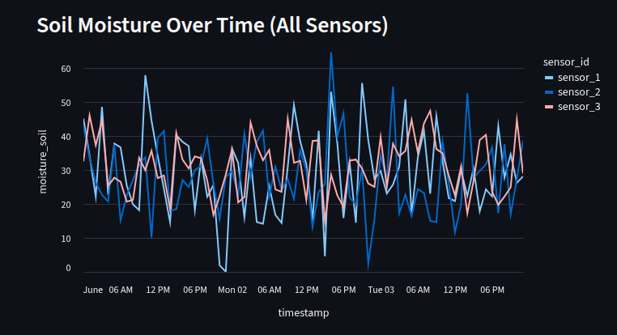
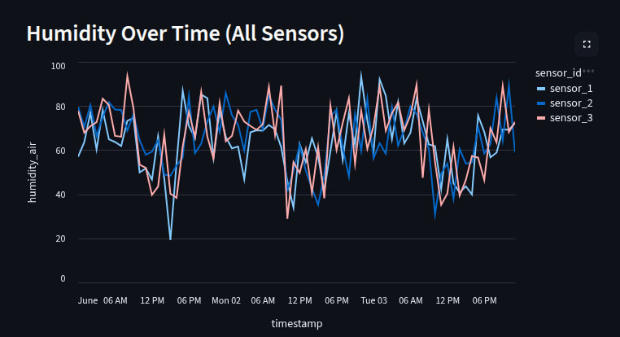
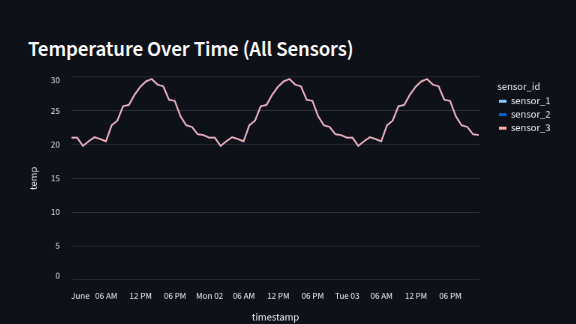

# FIAP - Faculdade de Informática e Administração Paulista

 

# Gerenciador de Colheira de Cana de Açucar

## Kalil

## 👨‍🎓 Integrantes

- <a href="https://github.com/kalilReis">Kalil Reis de Sisto</a>

## 👩‍🏫 Professores

### Tutor(a)

- <a href="https://www.linkedin.com/company/inova-fusca">Leonardo Ruiz Orabona</a>

### Coordenador(a)

- <a href="https://www.linkedin.com/company/inova-fusca"> André Godoy acho</a>

## 📜 Descrição

Este projeto utiliza ciência de dados e aprendizado de máquina para monitorar e otimizar a irrigação agrícola, analisando dados de umidade do solo e condições ambientais. A solução inclui dashboards interativos para visualização dos dados e suporte à tomada de decisão, promovendo o uso eficiente de recursos hídricos no campo.

O arquivo CSV irrigation_data.csv contém registros horários coletados por sensores instalados no campo. Cada linha apresenta o momento da medição (timestamp), o identificador do sensor (sensor_id), a hora do dia (hour), a temperatura do ar (temp), a umidade relativa do ar (humidity_air), a umidade do solo (moisture_soil) e um indicador se houve irrigação naquele período (irrigated). Esses dados são fundamentais para análise do comportamento do solo e para o desenvolvimento de modelos preditivos de irrigação.

_Gráfico que mostra a variação da umidade do solo ao longo do tempo, permitindo identificar padrões e necessidades de irrigação._

_Gráfico que apresenta a evolução da umidade relativa do ar, auxiliando na análise das condições ambientais que impactam a irrigação._

_Gráfico que exibe a variação da temperatura do ar ao longo do tempo, permitindo avaliar o impacto térmico nas condições do solo e na necessidade de irrigação._

_Gráfico que demonstra as previsões do modelo de irrigação, indicando os períodos em que a irrigação é recomendada com base na análise dos dados coletados._

## 📁 Estrutura de pastas

Dentre os arquivos e pastas presentes na raiz do projeto, definem-se:

- <b>assets</b>: aqui estão os arquivos relacionados a elementos não-estruturados deste repositório, como imagens.

- <b>document</b>: aqui estão todos os documentos do projeto que as atividades poderão pedir. Na subpasta "other", adicione documentos complementares e menos importantes.

- <b>src</b>: Todo o código fonte criado para o desenvolvimento do projeto ao longo das 7 fases.

- <b>README.md</b>: arquivo que serve como guia e explicação geral sobre o projeto (o mesmo que você está lendo agora).

## 🔧 Como executar o código

_Acrescentar as informações necessárias sobre pré-requisitos (IDEs, serviços, bibliotecas etc.) e instalação básica do projeto, descrevendo eventuais versões utilizadas. Colocar um passo a passo de como o leitor pode baixar o seu código e executá-lo a partir de sua máquina ou seu repositório. Considere a explicação organizada em fase._

## 🗃 Histórico de lançamentos

- ## 0.5.0 - XX/XX/2024
- ## 0.4.0 - XX/XX/2024
- ## 0.3.0 - XX/XX/2024
- ## 0.2.0 - XX/XX/2024
- ## 0.1.0 - XX/XX/2024

## 📋 Licença

<a property="dct:title" rel="cc:attributionURL" href="https://github.com/agodoi/template">MODELO GIT FIAP</a> por <a rel="cc:attributionURL dct:creator" property="cc:attributionName" href="https://fiap.com.br">Fiap</a> está licenciado sobre <a href="http://creativecommons.org/licenses/by/4.0/?ref=chooser-v1" target="_blank" rel="license noopener noreferrer" style="display:inline-block;">Attribution 4.0 International</a>.

